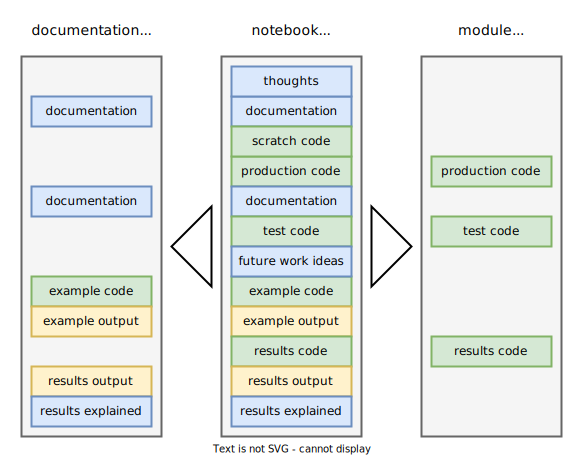

---
jupytext:
  formats: ipynb,md:myst
  text_representation:
    extension: .md
    format_name: myst
    format_version: 0.13
    jupytext_version: 1.14.0
kernelspec:
  display_name: Python 3 (ipykernel)
  language: python
  name: python3
---

```{raw-cell}
:tags: []

---
title: "NBD"
format:
  html: 
    code-fold: true
    ipynb-filters:
      - reseng/nbd.py filter-docs
---
```

+++ {"tags": ["nbd-docs"]}

"NBD" means *development in the notebook*. This tool supports usage of Jupyter notebooks for [literate programming](https://en.wikipedia.org/wiki/Literate_programming). Under the literate programming paradigm, a computer program is given an explanation of its logic in a natural language, such as English, interspersed (embedded) with snippets of macros and traditional source code, from which compilable source code can be generated.

Our approach was greatly inspired by the [nbdev](https://github.com/fastai/nbdev) project. Compared to `nbdev`, this tool that we call `nbd` has a more limited set of functionality, and is thus easier to use and maintain. The functions of `nbd` are the following:

- Locate project root directory.
- Selectively convert notebook cells to a Python script.
- Filter cells for documentation generation.

```{code-cell} ipython3
:tags: [nbd-module]

import sys
import os
import re
from pathlib import Path
import inspect

import nbconvert
import nbformat
```

+++ {"tags": ["nbd-docs"]}

# File structure

To use NBD features, project files should be organized into a specific structure. 
Here is the minimal file structure, using this project as an example:

```
nbs/                 # notebooks dir
  nbd.ipynb          # this notebook
  reseng/            # symlink to ../reseng/
  _site/             # Web documentation dir
    nbd.html         # doc page built from nbd.ipynb
reseng/              # Python package dir
  nbd.py             # module built from nbd.ipynb
```

`reseng` directory contains a Python package, built out of notebooks in the `nbs` directory.
Symbolic link `nbs/reseng -> ../reseng` is created to make the package visible and easily importable from notebooks, so project modules can use each other within the project.

+++

## package visibility

Package, subpackages and modules should be importable both from a notebook and from a module.
There are different ways to achieve this:

- `cd` to project root in the notebook before doing imports.
Simple `%cd ..` will work (can be `%cd ../..` for subpackage notebooks), but can not be executed repeatedly.
Or a loop that goes `cd ..` until at root.
- Create symlink to package dir at the same dir where the notebook is.
Needs to be repeated for each subpackage.
- `pip install -e .`.
Requires package to be pip-installable properly.

We use the approach of creating symbolic links, which seems to be more robust then `cd` and less intrusive than `install -e`.
Symlinks are created in the `index.init()` function of the [index](index.ipynb) module.

+++ {"tags": ["nbd-docs"]}

# Project root

To use `Nbd`, create an instance with the name of your package, e.g. `nbd = Nbd('popemp')`, then call methods from that instance.

When new `Nbd` object is created, it searches for an absolute path of the project root directory and stores it in the `Nbd.root` field.
This path is detected automatically and is the root directory of the project in which `Nbd` is instantiated.

+++

## root path detection

Project root path is detected by going up until directory contains both `nbs` and package (`reseng` in this case) folders.
The main challenge is to choose starting path from where to go up.

In a notebook or other interactive session context, we start from the current working directory.
When notebook kernel starts, working directory is set to notebook directory.
We assume that there are no directory changes before search happens.
It would be helpful to be able to identify current notebook file name, but currently existing methods are very hacky. 
There is a long standing open [GitHub issue](https://github.com/jupyter/notebook/issues/1000), and a default way to get notebook file path may be added in notebook v7.

In the context of a Python module (`.py` file), we can not obtain starting location from `__file__`, because it will always point to location of the `nbd.py` file, even if it is imported from somewhere outside of current project.
This will limit use of `nbd` as a library.
Instead, we inspect call stack to identify what called the `Nbd` class initialization.
If the caller is an interactive interpreter, identfied by common interpreter names, then search up from current working directory.
Otherwise the caller must be some other file, in which case, file parent is used as a starting point.
If `Nbd` is called from a module, that module will be correctly identified as caller, and module file location will be used even if the module itself is imported into an interactive session.
This is important to correctly identify subproject roots.

```{code-cell} ipython3
:tags: [nbd-module]

class Nbd:
    nbs_dir_name = 'nbs'
    
    def __init__(self, pkg_name):
        self.pkg_name = pkg_name
        self.root = self._locate_root_path()
        self.pkg_path = self.root / pkg_name
        self.nbs_path = self.root / self.nbs_dir_name
        self.tmp = self.root / 'tmp' # convenience shortcut, may not exist
        
        # verify that symlink to package dir exists inside of nbs dir
        p = self.nbs_path / pkg_name
        assert p.exists() and p.is_symlink()

    def _locate_root_path(self):
        # call stack: 0=this function, 1=__init__(), 2=caller
        caller = inspect.stack()[2].filename
        interpreters = ['<ipython-input', 'xpython_', 'ipykernel_', '<stdin>']
        if any(x in caller for x in interpreters):
            # class initialized from interactive shell or notebook
            p0 = '.'
        else:
            # class initialized from module
            p0 = caller
        p = p0 = Path(p0).resolve()
        while p != p.anchor:
            pkg_dir = p / self.pkg_name
            nbs_dir = p / self.nbs_dir_name
            if pkg_dir.exists() and nbs_dir.exists():
                return p
            p = p.parent
        raise Exception(f'Could not find project root above "{p0}".')

def test_nbd_init():
    nbd = Nbd('reseng')
    print('Project root:', nbd.root)
    pkg_dir = Path('reseng')
    print('Package modules:', ', '.join(str(p.relative_to(pkg_dir)) for p in pkg_dir.iterdir() if p.suffix == '.py'))
```

```{code-cell} ipython3
:tags: []

test_nbd_init()
```

+++ {"tags": ["nbd-docs"]}

# Cell filtering

The key idea of the NBD approach is to use the Jupyter notebook as the only source that is manually edited, and to automatically convert it into module (script) and documentation files.
Jupyter notebook is a linear sequence of cells.
By designating each cell to belong to module, documentation, both or neither, we can flexibly filter the notebook during conversion.
The diagram below illustrates this approach.



+++ {"tags": ["nbd-docs"]}

# Conversion to module

Method `Nbd.nb2mod()` selectively exports code cells into a module (script), mirroring relative path to the notebook in the package folder.
Only code cells with a `nbd-module` tag are exported.

## import statements

All imports from project modules into notebooks must take absolute form `from package import module` or `from package.module import object`.
Relative import statements are good for package portability, but do not work in a notebook.
Helper function `Nbd._relative_import()` replaces absolute imports of modules from the project package with relative ones.
For example, `from reseng.nbd import Nbd` will become `from .nbd import Nbd`.
For this reason, statement form `import ...` can not be used to import project modules.

+++ {"tags": []}

## conversion with Jupytext

*Alternative approach.*
Jupytext can automatically maintain script version of the notebook.
For example, this notebook can be configured to exist in three formats - .ipynb and .md in `nbs` folder and .py in `reseng` folder - by setting in the notebook metadata: `"formats": "nbs///ipynb,nbs///md:myst,reseng///py:nomarker"`.
We can use `ipynb-active` cell tags to comment out unwanted code in the script.  
One limitation of this automatic conversion is that absolute paths are not changed to relative.
So modules will not corretly import other package modules, unless execution is started from a folder where package or it's symlink is.
But then the package can not be used as a dependency in another project.

```{code-cell} ipython3
:tags: [nbd-module]

def __relative_import(self, line, script_rel_path):
    """Replace absolute import statement in a line with relative.
    `script_rel_path` must be relative to package dir.
    """
    pattern = r'^(\s*)from \s*(\S+)\s* import (.*)$'
    m = re.match(pattern, line)
    if not m: 
        return line
    indent, abs_module, obj = m.groups()
    if not abs_module.startswith(self.pkg_name):
        return line
    
    module_as_rel_path = Path(*abs_module.split('.')[1:])
    script_rel_path = Path(script_rel_path)
    common_prefix = Path(os.path.commonpath([module_as_rel_path, script_rel_path]))
    module_rel_to_prefix = module_as_rel_path.relative_to(common_prefix).parts
    script_rel_to_prefix = script_rel_path.relative_to(common_prefix).parts
    rel_module = '.' * len(script_rel_to_prefix) + '.'.join(module_rel_to_prefix)
    
    return f'{indent}from {rel_module} import {obj}'
Nbd._relative_import = __relative_import

def test_relative_import():
    from types import SimpleNamespace
    x = SimpleNamespace(pkg_name='pkg')
    tests = [
        ('a.py', 'not an import statement', 'not an import statement'),
        ('a.py', 'from not_pkg import obj', 'from not_pkg import obj'),
        ('a2.py', 'from pkg import a1', 'from . import a1'),
        ('a2.py', '    from pkg import a1', '    from . import a1'),
        ('a2.py', 'from pkg.a1 import b', 'from .a1 import b'),
        ('a/b2.py', 'from pkg.a import b1', 'from . import b1'),
        ('a2/b.py', 'from pkg import a1', 'from .. import a1'),
        ('a2/b.py', 'from pkg.a1 import b', 'from ..a1 import b'),
        ('a/b/c2.py', 'from pkg.a.b import c2', 'from . import c2'),
        ('a/b2/c.py', 'from pkg.a import b1', 'from .. import b1'),
        ('a/b2/c.py', 'from pkg.a.b1 import c', 'from ..b1 import c'),
        ('a2/b/c.py', 'from pkg.a1.b import c', 'from ...a1.b import c')
    ]
    for file, line, expected in tests:
        assert __relative_import(x, line, file) == expected
```

```{code-cell} ipython3
:tags: []

test_relative_import()
```

```{code-cell} ipython3
:tags: [nbd-module]

def __nb2mod(self, nb_rel_path):
    """Convert notebook to script, only including cells tagged with "nbd-module".
    `nb_rel_path` is relative to project's notebook directory."""
    nb_rel_path = Path(nb_rel_path)
    nb_path = self.nbs_path / nb_rel_path
    assert nb_path.is_file(), f'Notebook not found at "{nb_path}".'
    nb = nbformat.read(nb_path, nbformat.current_nbformat)
    nb.cells = [c for c in nb.cells 
                if ((c.cell_type == 'code') 
                    and ('tags' in  c.metadata)
                    and ('nbd-module' in c.metadata.tags))]
    exporter = nbconvert.exporters.PythonExporter(exclude_input_prompt=True)
    script, _ = exporter.from_notebook_node(nb)
    mod_path = self.pkg_path / nb_rel_path.with_suffix('.py')

    # convert abs to rel imports
    script = '\n'.join(self._relative_import(l, mod_path.relative_to(self.pkg_path))
                       for l in script.split('\n'))

    mod_path.parent.mkdir(parents=True, exist_ok=True)
    mod_path.write_text(script)

    src = nb_path.relative_to(self.root)
    dst = mod_path.relative_to(self.root)
    print(f'Converted notebook "{src}" to module "{dst}".')
Nbd.nb2mod = __nb2mod

def test_nbd_nb2mod():
    nbd = Nbd('reseng')
    nbd.nb2mod('nbd.ipynb')
```

```{code-cell} ipython3
:tags: []

test_nbd_nb2mod()
```

+++ {"tags": []}

## filter using comments

Under the hood, `Nbd` turns notebooks into modules (scripts) using `nbconvert`.
`nbconvert` can be configured to filter out unwanted cells with `RegexRemovePreprocessor` or `TagRemovePreprocessor`.
We use cell tags, but it is also possible to use designated comment lines with regex preprocessor.
`# comments` are natural for code cells.
For Markdown, we can use `<!--- HTML comments -->` or Markdown named links: `[nbd]: # "flag1 flag2"`.
See this [SO question](https://stackoverflow.com/q/4823468) for different Markdown comment alternatives.

If we want to match anywhere in the cell we need `patterns=['(?ms).*ABRA']`, where `(?ms)` are regex flags: re.M (multi-line), re.S (dot matches all).

Example below shows how to use `nbconvert` API to export notebook to a script and only keep cells that start with `#nbd module`.

```{code-cell} ipython3
:tags: []

prep_select_module_cells = nbconvert.preprocessors.RegexRemovePreprocessor(patterns=['(?!#nbd module)'])
exporter = nbconvert.exporters.PythonExporter(preprocessors=[prep_select_module_cells], exclude_input_prompt=True)
script, _ = exporter.from_filename('notebook.ipynb')
```

+++ {"tags": ["nbd-docs"]}

# Conversion to documentation

Conversion is performed by an external tool [Quarto](https://quarto.org/).
Quarto takes an `.ipynb` file with all it's outputs and turns it into HTML.
Quarto supports a rich Markdown syntax for output customization.
NBD only provides a cell filtering function, leaving out all cells not flagged with `nbd-docs`.
This function is exposed as module's CLI interface and can be automatically applying by configuring Quarto like this:

```yaml
format:
  html: 
    ipynb-filters:
      - reseng/nbd.py filter-docs
```

We build a website documentation from notebooks using quarto, and then publish it to GitHub Pages with [ghp-import](https://github.com/c-w/ghp-import).
Documentation is pushed to a separate `gh-pages` branch.
Every push overwrites previous commit, erasing the history.

```bash
ghp-import --no-history --push --force nbs/_site
```

```{code-cell} ipython3
:tags: [nbd-module]

def filter_docs():
    """Only keep cells with "nbd-docs" tag.
    Reads notebook from STDIN and prints filtered notebook to STDOUT.
    """
    nb = nbformat.reads(sys.stdin.read(), as_version=nbformat.NO_CONVERT)
    nb.cells = [
        c for c in nb.cells
        if ('tags' in c.metadata) and ('nbd-docs' in c.metadata.tags)
    ]
    nbformat.write(nb, sys.stdout)
```

## other tools

In the past, we have used different other tools to make documentation out of Jupyter notebooks, including `nbconvert`, `nbdev` and [MkDocs](https://www.mkdocs.org/).
Quarto is powerful, well supported and can be also used with RMarkdown notebooks.

+++ {"tags": ["nbd-docs"]}

# Notebooks and Git

Jupyter notebooks are technically JSON files with possibly embedded binary data in output cells (e.g. images).
This make them not very Git friendly, because most Git tools are designed to work with plain text files.
Git diffs of notebooks are not very readable, merges break notebooks, and binary blobs clog storage and don't diff or merge.
We use [Jupytext](https://github.com/mwouts/jupytext) tool to only version Markdown replicas of notebooks and add `.ipynb` files to `.gitignore`.

+++

## nbdime

We have previously versioned `.ipynb` files with Git, but cleared outputs and metadata either manually or with [nbdime](https://github.com/jupyter/nbdime).
`nbdime` can be configured to automatically clean notebooks at pre-commit time, and has tools to diff and merge notebook files.
This is workable approach, but configuration and maintenance overhead was higher than with Jupytext.

+++ {"tags": ["nbd-docs"]}

# CLI interface

If `tools.py` is execuded directly as a module with `filter-docs` argument, it will apply the documentation filter.
This is used for `ipynb-filters` option of Quarto renderer.

```{code-cell} ipython3
:tags: [nbd-module]

if __name__ == '__main__':
    if sys.argv[1] == 'filter-docs':
        filter_docs()
```

# Tests

```{code-cell} ipython3
:tags: [nbd-module]

def test_all():
    test_nbd_init()
    test_relative_import()
    test_nbd_nb2mod()
```

```{code-cell} ipython3
:tags: []

test_all()
```

+++ {"tags": []}

# Build this module

```{code-cell} ipython3
:tags: []

from reseng.nbd import Nbd
nbd = Nbd('reseng')
nbd.nb2mod('nbd.ipynb')
```
